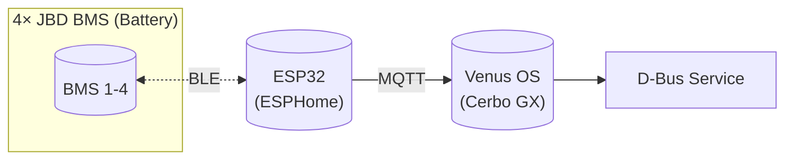

# ESPHome JBD BMS Monitor

[](https://github.com/victron-venus/esphome-jbd-bms-mqtt/actions/workflows/ci.yml)
[](https://opensource.org/licenses/MIT)
[](https://github.com/victron-venus/esphome-jbd-bms-mqtt/releases)
[](https://github.com/victron-venus/esphome-jbd-bms-mqtt/releases)
[](https://esphome.io/)
[](https://www.espressif.com/en/products/socs/esp32)
[](https://github.com/victron-venus/esphome-jbd-bms-mqtt/watchers)
[](https://github.com/victron-venus/esphome-jbd-bms-mqtt/graphs/contributors)
[](https://github.com/victron-venus/esphome-jbd-bms-mqtt/issues)
[](https://github.com/victron-venus/esphome-jbd-bms-mqtt/issues?q=is%3Aissue+is%3Aclosed)
[](https://github.com/victron-venus/esphome-jbd-bms-mqtt/pulls)
[](https://github.com/victron-venus/esphome-jbd-bms-mqtt/commits/main)
[](https://github.com/victron-venus/esphome-jbd-bms-mqtt)
[](https://github.com/victron-venus/esphome-jbd-bms-mqtt)
[](https://github.com/victron-venus/esphome-jbd-bms-mqtt/graphs/commit-activity)
[](https://github.com/victron-venus/esphome-jbd-bms-mqtt/pulls)
[](https://esphome.io/)
[](https://community.victronenergy.com/)

ESP32-based Bluetooth proxy for JBD BMS batteries, publishing data via MQTT to Victron Venus OS.

> **Note**: This project requires [dbus-mqtt-battery](https://github.com/victron-venus/dbus-mqtt-battery) running on Venus OS to integrate MQTT data into the Victron system.

<!-- ci-release-process:start -->
## CI and deployment

See [CI and deployment workflow](docs/release-workflow.md) for required checks and local commands. This repository uses validation-only policy; application release channels do not apply.
<!-- ci-release-process:end -->

## Overview

This project solves the problem of integrating JBD (Jiabaida) BMS-equipped LiFePO4 batteries with Victron Energy systems. Direct Bluetooth communication from Raspberry Pi/Cerbo GX to JBD BMS proved unreliable and caused system instability (reboots due to memory leaks in BLE stack).

### Architecture



### Why ESP32?

- **Dedicated BLE processing**: Offloads Bluetooth Low Energy communication from the main system
- **Reliable connections**: ESP32's BLE stack handles multiple simultaneous connections well
- **Low latency**: Direct BLE-to-MQTT bridge with minimal overhead
- **OTA updates**: Update firmware wirelessly without physical access

## Screenshot


## Hardware Requirements

- **ESP32 DevKit** (ESP32-WROOM-32 or similar) - one per 4 batteries
- **JBD BMS** with Bluetooth module (tested with SP04S034, SP10S020, SP16S025)
- **WiFi network** with MQTT broker access
- **USB cable** for initial flash only (OTA updates after)

## Configuration Files

| File | Description | Batteries |
|------|-------------|-----------|
| `jbd-all-batteries1.yaml` | Chain 1 - Primary ESP32 | BMS 1-4 |
| `jbd-all-batteries2.yaml` | Chain 2 - Secondary ESP32 | BMS 5-8 |
| `jbd-all-batteries.yaml` | Legacy 8-BMS config (archive) | BMS 1-8 |
| `secrets.yaml` | WiFi and sensitive credentials | - |

## Installation on macOS

### Prerequisites

#### Method 1: Using Homebrew (Recommended)

If your network allows access to Homebrew packages:

```bash
# Install Homebrew if not present
/bin/bash -c "$(curl -fsSL https://raw.githubusercontent.com/Homebrew/install/HEAD/install.sh)"

# Install ESPHome and dependencies
brew install esphome platformio

# Verify installation
esphome version
```

#### Method 2: Using pipx (Alternative)

If Homebrew ESPHome is not available:

```bash
# Install pipx
brew install pipx
pipx ensurepath

# Install ESPHome via pipx
pipx install esphome

# Verify installation
esphome version
```

#### Method 3: Manual Installation (No PyPI Access)

If your network blocks PyPI (pypi.org), you can use offline installation:

```bash
# Option A: Use a different network/VPN temporarily to download
# Then copy the packages to your machine

# Option B: Download wheel files manually from another computer
# 1. On a computer with PyPI access:
pip download esphome -d ./esphome_packages/

# 2. Copy esphome_packages folder to your Mac
# 3. Install from local files:
pip install --no-index --find-links=./esphome_packages/ esphome

# Option C: Use conda/mamba with different mirrors
conda install -c conda-forge esphome
```

### Clone External Components (if GitHub is blocked)

If git cannot access GitHub due to SSL issues:

```bash
# Download as ZIP and extract
curl -L -o /tmp/esphome-jbd-bms.zip \
    https://github.com/syssi/esphome-jbd-bms/archive/refs/heads/main.zip
unzip /tmp/esphome-jbd-bms.zip -d /tmp/

# Copy components to local folder
cp -r /tmp/esphome-jbd-bms-main/components ./components/

# Update yaml to use local source:
# external_components:
#   - source:
#       type: local
#       path: components
#     components: [jbd_bms_ble]
```

## Configuration

### 1. Edit secrets.yaml

```yaml
wifi_ssid: "YOUR_WIFI_SSID"
wifi_pass: "YOUR_WIFI_PASSWORD"
```

### 2. Update BMS MAC Addresses

Edit `jbd-all-batteries1.yaml` and update the MAC addresses for your BMS devices:

```yaml
jbd_bms_ble:
  - id: bms1
    ble_client_id: client_bms1
    # Your BMS MAC address (find using BLE scanner or JBD app)
```

To find your BMS MAC addresses:
1. Use the ESPHome BLE scanner: `esp32-ble-scanner.yaml` from the jbd-bms repo
2. Or use the JBD mobile app and note the device address

### 3. Set MQTT Broker

Update the MQTT configuration in the yaml file:

```yaml
mqtt:
  broker: <VENUS_OS_IP>  # Your Venus OS / MQTT broker IP
  topic_prefix: battery   # Use 'battery' for chain1, 'battery2' for chain2
```

## Compiling and Uploading

### First Flash (USB Required)

Connect ESP32 via USB and run:

```bash
cd /path/to/esphome/

# For Chain 1 (ESP32 #1)
esphome run jbd-all-batteries1.yaml

# For Chain 2 (ESP32 #2)
esphome run jbd-all-batteries2.yaml
```

Select the USB port when prompted (e.g., `/dev/cu.usbserial-0001`).

### OTA Updates (Wireless)

After initial flash, update wirelessly:

```bash
# Compile only
esphome compile jbd-all-batteries1.yaml

# Upload via OTA (device must be on same network)
esphome upload jbd-all-batteries1.yaml --device jbd-all-batteries.local

# Or specify IP directly
esphome upload jbd-all-batteries1.yaml --device <ESP32_IP>
```

### Compile Only (No Upload)

```bash
# Validate and compile without uploading
esphome compile jbd-all-batteries1.yaml
```

### View Logs

```bash
# Stream logs from ESP32
esphome logs jbd-all-batteries1.yaml

# Or via IP
esphome logs jbd-all-batteries1.yaml --device <ESP32_IP>
```

## ESP32 Web Interface

After flashing, access the ESP32 web interface:

- **URL**: `http://jbd-all-batteries.local` or `http://<ESP32_IP>`
- **Features**:
  - Real-time sensor values
  - WiFi signal strength
  - Restart button
  - OTA upload

## MQTT Topics

The ESP32 publishes to the following MQTT topics:

### Chain 1 (topic_prefix: battery)
```
battery/sensor/voltage_bms1/state     # Battery 1 voltage (V)
battery/sensor/current_bms1/state     # Battery 1 current (A)
battery/sensor/soc_bms1/state         # Battery 1 state of charge (%)
battery/sensor/capacity_remaining_bms1/state  # Remaining capacity (Ah)
battery/sensor/temperature1_bms1/state  # Temperature sensor 1 (°C)
battery/sensor/voltage_cell1_bms1/state # Cell 1 voltage (V)
battery/sensor/voltage_cell2_bms1/state # Cell 2 voltage (V)
...
battery/binary_sensor/charging_bms1/state    # Charging enabled (ON/OFF)
battery/binary_sensor/discharging_bms1/state # Discharging enabled (ON/OFF)
battery/binary_sensor/online_bms1/state      # BMS online status
```

### Aggregated Values
```
battery/sensor/voltage_total/state    # Sum of all battery voltages
battery/sensor/current_total/state    # Average current
battery/sensor/soc_total/state        # Average SoC
battery/sensor/capacity_total/state   # Total remaining capacity
```

**SOC Calculation Logic**: `soc_total` calculates the average SoC of all batteries while filtering out outliers. If battery SoC values differ by more than 20%, values closest to the min/max are excluded from the average. This handles inaccurate BMS reporting — individual JBD BMS units can drift over time, but averaging across the battery chain produces reliable results.

## Troubleshooting

### ESPHome Cannot Connect to GitHub
```
unable to access 'https://github.com/syssi/esphome-jbd-bms.git/': SSL_ERROR
```
**Solution**: Download components manually (see "Clone External Components" above)

### PlatformIO venv Creation Fails
```
Error: Failed to install Python dependencies into penv
```
**Solution**:
```bash
rm -rf ~/.platformio/penv
brew install platformio  # Use brew version
```

### ESP32 Not Found via OTA
**Solution**:
- Check ESP32 is on same network
- Use IP address instead of hostname
- Verify ESP32 has power and WiFi connected

### BMS Not Connecting via BLE
**Solution**:
- Verify MAC address is correct
- Check BMS Bluetooth is enabled (blue LED blinking)
- Ensure no other device is connected to BMS
- Restart ESP32: `esphome run ... --device <ip>`

### High Memory Usage on ESP32
**Solution**: The configuration uses ESP-IDF framework with optimizations:
- `CONFIG_BT_ALLOCATION_FROM_SPIRAM_FIRST: y`
- `minimum_chip_revision: "3.1"` (enables compiler optimizations)

## Battery Configuration

This setup is designed for **series-connected** LiFePO4 batteries:

- **4 batteries in series**: 4 × 12V = 48V nominal
- **Capacity**: 280 Ah (stays the same in series)
- **Cells per battery**: 4 cells (4S LiFePO4)
- **Total cells**: 16 cells across the chain

Example: ECO-WORTHY 12V 280Ah LiFePO4 with built-in JBD BMS

## Files Reference

```
esphome/
├── README.md                 # This file
├── secrets.yaml              # WiFi credentials (not in git)
├── jbd-all-batteries1.yaml   # Chain 1 config (4 BMS)
├── jbd-all-batteries2.yaml   # Chain 2 config (4 BMS)
├── jbd-all-batteries.yaml    # Legacy 8 BMS config
├── components/               # Local JBD BMS component (optional)
│   └── jbd_bms_ble/
└── .esphome/                 # Build cache (auto-generated)
```

## Integration with Venus OS

After ESP32 is running, install the MQTT-to-D-Bus bridge on Venus OS:

```bash
# On Venus OS (Cerbo GX)
cd /data/apps/dbus-mqtt-battery
./install.sh <VENUS_OS_IP>  # MQTT broker IP
```

See the [dbus-mqtt-battery](https://github.com/victron-venus/dbus-mqtt-battery) README for full Venus OS integration instructions.

## Related Projects

This project is part of the Victron Venus OS integration suite:

| Project | Description |
|---------|-------------|
| [inverter-control](https://github.com/victron-venus/inverter-control) | Advanced ESS external control system with grid-zero targeting |
| [inverter-dashboard](https://github.com/victron-venus/inverter-dashboard) | Real-time web dashboard (Python/FastAPI) via MQTT |
| [inverter-dashboard-go](https://github.com/victron-venus/inverter-dashboard-go) | High-performance Go rewrite of the web dashboard |
| [inverter-desktop](https://github.com/victron-venus/inverter-desktop) | Native desktop application (Rust/Tauri) for system monitoring |
| [dbus-mqtt-battery](https://github.com/victron-venus/dbus-mqtt-battery) | MQTT to D-Bus bridge for JBD BMS battery integration |
| [dbus-tasmota-pv](https://github.com/victron-venus/dbus-tasmota-pv) | Tasmota smart plug integration as a PV inverter on D-Bus |
| **esphome-jbd-bms-mqtt** (this) | ESP32 Bluetooth monitor for JBD BMS batteries |
| [inverter-monitoring](https://github.com/victron-venus/inverter-monitoring) | TIG (Telegraf, InfluxDB, Grafana) monitoring stack |
| [terraform-github-victron](https://github.com/4alvit/terraform-github-victron) | Infrastructure as Code for the GitHub organization |

## License

This project uses the [esphome-jbd-bms](https://github.com/syssi/esphome-jbd-bms) component by @syssi.

## Contributing

1. Fork the repository
2. Create a feature branch
3. Submit a pull request

## Support

For issues specific to:
- **JBD BMS communication**: See [esphome-jbd-bms issues](https://github.com/syssi/esphome-jbd-bms/issues)
- **ESPHome**: See [ESPHome documentation](https://esphome.io/)
- **This integration**: Open an issue in this repository

**Note:** This is a community project and is not affiliated with Victron Energy.


## Firmware CI

### MQTT discovery identity when using both chains

Chain 1 explicitly retains ESPHome's `legacy` discovery IDs so existing Home
Assistant entity IDs, automations, and history remain associated with it. Chain 2
uses `discovery_unique_id_generator: mac`; additional monitors must also use the
MAC generator. Different MQTT topic prefixes alone do **not** make legacy
discovery IDs unique: both chains otherwise publish IDs such as
`ESPsensorvoltage_bms1`.

For an existing installation, inspect the retained discovery documents and the
Home Assistant device/entity registries before uploading. The chain that already
owns the legacy IDs must retain them. Historical entity names can be misleading
after a collision: our existing `jbd_chain2_monitor_*` IDs belong to the Chain 1
device. Keep those IDs unchanged rather than moving their history to another
battery. Give the newly discovered Chain 2 entities distinct IDs.

When Home Assistant uses another broker, bridge the `battery` and `battery2`
sensor/binary-sensor state topics and their `status` topics **inbound** as well as
the discovery documents. Bridging discovery alone creates unavailable entities.
Do not bridge restart commands or battery control topics as part of this repair.
An `offline` status must be resolved at the publisher; do not publish a fabricated
`online` message to hide it.

Prepare a rollback image using the installed ESPHome version and current live
settings before an OTA change. Update only the discovery generator, preserve the
running BLE scan/polling configuration, and verify both chains' fresh telemetry
afterwards. This does not change any BMS protection or charging settings.

See [ESPHome MQTT discovery configuration](https://esphome.io/components/mqtt/#configuration-variables).

Changes to YAML and workflow files run validation and compilation for all three
configurations. CI uses ESPHome 2026.8.2 and a pinned esphome-jbd-bms revision,
with placeholder Wi-Fi credentials. Compilation never uploads firmware.
The upgrade from 2024.12 is required for the existing minimum-chip-revision option;
the BLE advertisement trigger uses the supported `on_ble_advertise` name.
